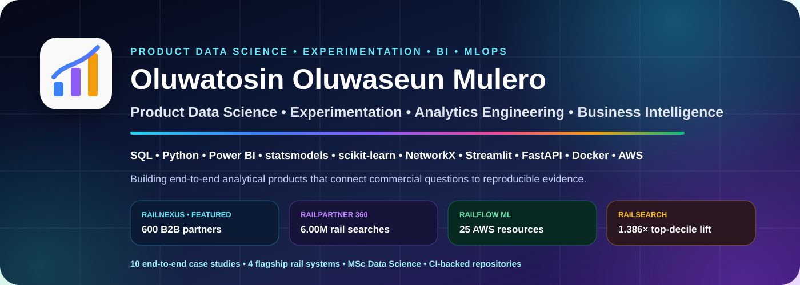

  

  
  
  

# Analytics Engineering • Business Intelligence • Data Science

I build **decision-ready analytical systems**, not isolated charts. My portfolio combines SQL, PostgreSQL, dbt, Python, Power BI, PBIP/PBIR/TMDL, machine learning, automation and reproducible analytics engineering.

The **GitHub profile and portfolio website use the same project hierarchy, metrics and evidence**.

| Portfolio proof | Evidence |
|---|---:|
| End-to-end case studies | **7** |
| Rail searches analysed | **6.00M** |
| Rail bookings analysed | **2.00M** |
| Rail platform revenue | **£9.03M** |
| Customer 360 customers analysed | **270,154** |
| Cyclistic rides analysed | **5.93M** |
| Olist delivered orders | **96,211** |

---

## Capability Matrix

  
  
  
  
  
  
  
  
  
  
  

**Analytics Engineering:** PostgreSQL • SQL • dbt • dimensional modelling • marts • validation • automation  
**Business Intelligence:** Power BI • DAX • Power Query • PBIP • PBIR • TMDL • executive reporting  
**Data Science:** Python • pandas • scikit-learn • XGBoost • LightGBM • Optuna • SHAP  
**Delivery:** Git • GitHub • GitHub Actions • Pytest • MLflow • FastAPI • Streamlit

---

# Featured Portfolio Projects

## 01 — RailPartner 360 — B2B Rail Retail & Customer Intelligence

  

End-to-end analytics engineering and BI platform connecting **customer conversion, B2B partner performance, route economics, operational reliability and refund exposure**.

| KPI | Result |
|---|---:|
| Searches | **6,000,000** |
| Bookings | **2,000,000** |
| Conversion | **33.33%** |
| Gross booking value | **£136.40M** |
| Platform revenue | **£9.03M** |
| B2B booking share | **63.86%** |
| Commercial value at risk | **£9.72M** |
| Power BI pages | **5** |
| PBIR visuals | **55** |

**Stack:** PostgreSQL • SQL • dbt • Python • pandas • Power BI • DAX • PBIP • PBIR • TMDL • Git

> Synthetic transaction-level rail data is used for portfolio demonstration. No proprietary Trainline or customer data is included.

---

## 02 — Credit Risk Intelligence & Explainable Default Prediction

Production-style credit-risk workflow covering model benchmarking, Optuna tuning, probability calibration, cost-sensitive thresholding, SHAP explainability, subgroup auditing, MLflow tracking, FastAPI, Streamlit and CI.

- **0.7834** ROC-AUC
- **0.5622** PR-AUC
- **80.71%** recall
- **29.1%** illustrative validation cost reduction

**Stack:** Python • XGBoost • LightGBM • Optuna • SHAP • MLflow • FastAPI • Streamlit • Pytest • GitHub Actions

---

## 03 — Customer 360 & Revenue Growth Analytics

End-to-end commercial analytics combining SQL, Python, Power BI, segmentation, forecasting and reproducible experimentation.

- **270,154** customers
- **4,419** purchasing customers
- **775** repeat purchasers
- **19.25%** synthetic A/B lift

**Stack:** SQL • Python • pandas • Power BI • DAX • Power Query • PBIP • PBIR • TMDL

---

## 04 — NHS Hospital Performance & Patient Flow

  

Provider benchmarking, four-hour performance, 12-hour waits, regional variation and patient-flow analytics.

| KPI | Result |
|---|---:|
| Provider-month records | **956** |
| Provider codes | **192** |
| Type 1 providers benchmarked | **120** |

**Stack:** Python • PostgreSQL • SQL • Power BI • DAX • Power Query

---

## 05 — Olist E-Commerce Analytics

  

Commercial, customer, logistics and retention analytics using PostgreSQL, SQL, Power BI and RFM segmentation.

| KPI | Result |
|---|---:|
| Delivered orders | **96,211** |
| Total order value | **R$15.37M** |
| Unique customers | **93,104** |
| Repeat-customer rate | **3.00%** |

**Stack:** PostgreSQL • SQL • Power BI • DAX • Power Query • RFM

---

## 06 — Cyclistic Rider Behaviour Analysis

  

Large-scale mobility analysis comparing member and casual rider behaviour across volume, duration, time and seasonality.

| KPI | Result |
|---|---:|
| Valid rides analysed | **5.93M** |
| Member share | **64.36%** |
| Casual share | **35.64%** |
| Casual average duration | **18.57 min** |

**Stack:** Python • pandas • Parquet • Power BI • DAX • Power Query

---

## 07 — Bellabeat Wellness Analysis

  

Fitbit activity and sleep analysis exploring steps, calories, sedentary behaviour, sleep duration and user-level patterns.

| KPI | Result |
|---|---:|
| Average daily steps | **7,801** |
| Average sleep | **419 min** |
| Sleep efficiency | **91.65%** |
| Steps vs calories correlation | **r ≈ 0.58** |

**Stack:** Python • pandas • Power BI • Behavioural Analytics

---

## Portfolio Standard

| Standard | Evidence |
|---|---|
| **Business relevance** | Commercial and operational questions drive each project |
| **Reproducibility** | Source-controlled pipelines, documented setup and validation |
| **Technical depth** | SQL, modelling, BI, ML, architecture and automation |
| **Decision focus** | KPIs, insights, risk identification and recommendations |
| **Responsible interpretation** | Limitations and synthetic-data disclosures are explicit |

---

## Education

### MSc Data Science — University of Greenwich

Data analytics • machine learning • statistical modelling • data-driven problem solving

---

  
  
  

<b>Turning complex data into decision-ready systems.</b>

